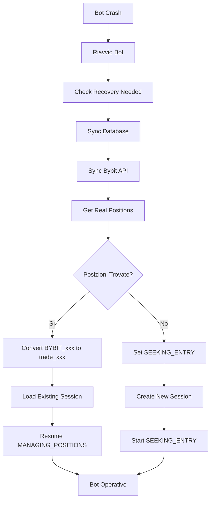

# 🔧 RISOLUZIONE PROBLEMI RECOVERY SYSTEM

## 📋 Problemi Identificati

### 1. **Application Context Error**
```
⚠️ Errore aggiornamento stato dopo chiusura: Working outside of application context.
```
**Causa**: Tentativo di accedere a `current_app` dal thread del bot fuori dal contesto Flask.

### 2. **Mismatch ID Trade**
```
ERROR:utils.database:Trade BYBIT_SHIB1000USDT_Buy_1755988205 non trovato
```
**Causa**: Recovery system trova ID Bybit (`BYBIT_xxx`) ma database ha ID interni (`trade_xxx`).

### 3. **Sessioni Non Chiuse**
**Causa**: Dopo recovery, le sessioni non vengono gestite correttamente nello storico.

---

## ✅ SOLUZIONI IMPLEMENTATE

### 1. **Risoluzione Application Context**

**File modificato**: `frontend/utils/bot_functions.py`

**Modifiche**:
- ❌ **Prima**: `from flask import current_app` nel thread bot
- ✅ **Dopo**: Passaggio diretto di `state_manager` e `bot_status` come parametri

```python
# PRIMA (PROBLEMATICO)
def execute_position_close(trade_id, side, symbol, current_price, trading_wrapper, socketio):
    state_manager = current_app.config.get('BOT_STATE_MANAGER')  # ❌ Errore context

# DOPO (CORRETTO)
def execute_position_close(trade_id, side, symbol, current_price, trading_wrapper, socketio, state_manager=None, bot_status=None):
    if state_manager and bot_status:  # ✅ Parametri diretti
```

### 2. **Sistema Mappatura ID Migliorato**

**File modificati**: 
- `frontend/utils/database.py`
- `frontend/utils/trading_wrapper.py`

**Nuove funzionalità**:

#### A. **Nuove Colonne Database**
```sql
ALTER TABLE trades ADD COLUMN bybit_order_id TEXT;
ALTER TABLE trades ADD COLUMN external_trade_id TEXT;
```

#### B. **Nuova Tabella Mappatura**
```sql
CREATE TABLE trade_id_mapping (
    internal_trade_id TEXT NOT NULL,  -- trade_20250821_205804_516456
    external_trade_id TEXT NOT NULL,  -- BYBIT_SHIB1000USDT_Buy_1755988205
    bybit_order_id TEXT,              -- order_abc123
    symbol TEXT,
    side TEXT
);
```

#### C. **Nuovi Metodi Database**
```python
trading_db.add_trade_id_mapping(internal_id, external_id, bybit_order_id, symbol, side)
trading_db.get_internal_trade_id(external_id)  # BYBIT_xxx -> trade_xxx
trading_db.get_external_trade_id(internal_id)  # trade_xxx -> BYBIT_xxx
trading_db.find_trade_by_symbol_side(symbol, side, session_id)
```

### 3. **Trading Wrapper Potenziato**

**Miglioramenti**:

#### A. **Apertura Posizione**
```python
# Ora salva ENTRAMBI gli ID
trade_id = trading_db.add_trade(...)  # ID interno: trade_xxx
external_id = f"BYBIT_{symbol}_{side}_{timestamp}"  # ID esterno

# Crea mappatura
trading_db.add_trade_id_mapping(trade_id, external_id, bybit_order_id, symbol, side)

# Memorizza entrambi
self.active_trades[trade_id] = {
    'external_trade_id': external_id,  # Per recovery
    'bybit_order_id': bybit_order_id,  # Per tracking Bybit
    ...
}
```

#### B. **Chiusura Posizione Intelligente**
```python
def close_position(self, trade_id=None, symbol=None, side=None, ...):
    # 1. Cerca negli active_trades
    # 2. Cerca per symbol+side negli active_trades  
    # 3. Se trade_id inizia con 'BYBIT_', converti a ID interno
    # 4. Cerca nel database per symbol+side se non trovato
```

#### C. **Sincronizzazione Bybit Migliorata**
```python
def sync_with_bybit(self):
    # 1. Ottieni posizioni da Bybit
    # 2. Per ogni posizione:
    #    - Cerca trade esistente nel database per symbol+side
    #    - Se esiste: recupera e usa ID esistente
    #    - Se non esiste: crea nuovo trade con mappatura ID
    # 3. Mantieni mappature coerenti
```

### 4. **Crash Recovery Potenziato**

**File modificato**: `frontend/utils/crash_recovery.py`

**Miglioramenti**:
```python
def _get_real_positions_from_exchange(self):
    # 1. Prima sincronizza database
    self.trading_wrapper.sync_with_database()
    
    # 2. Poi sincronizza Bybit
    sync_result = self.trading_wrapper.sync_with_bybit()
    
    # 3. Ottieni posizioni unificate
    real_positions = self.trading_wrapper.get_active_trades()
```

### 5. **Bot Functions Migliorato**

**File modificato**: `frontend/utils/bot_functions.py`

**Miglioramenti**:
- ✅ Recovery con sincronizzazione completa
- ✅ Preservazione sessioni esistenti
- ✅ Passaggio corretto parametri state_manager

---

## 🧪 TEST E VERIFICA

### Script di Test Creati:
1. **`update_database_schema.py`** - Aggiorna schema database
2. **`test_recovery_improvements.py`** - Verifica funzionalità

### Risultati Test:
```
✅ Mappatura ID: BYBIT_xxx <-> trade_xxx
✅ Ricerca trade per simbolo/lato
✅ Sincronizzazione database
✅ Schema database aggiornato
```

---

## 🚀 PROCEDURA UTILIZZO

### 1. **Aggiornamento Database** (Fatto)
```bash
cd frontend
python update_database_schema.py
```

### 2. **Test Sistema** (Fatto)
```bash
python test_recovery_improvements.py
```

### 3. **Riavvio Bot**
1. Ferma il bot se in esecuzione
2. Riavvia l'applicazione Flask
3. Testa recovery con posizioni aperte

---

## 📊 SCENARI RECOVERY SUPPORTATI

### Scenario 1: **Recovery con Posizioni Attive**
```
1. Bot crash con posizioni aperte
2. Riavvio bot
3. ✅ Recovery trova posizioni Bybit (ID: BYBIT_xxx)
4. ✅ Converte a ID interni (ID: trade_xxx)
5. ✅ Riprende monitoraggio posizioni
6. ✅ Chiusura funziona correttamente
7. ✅ Sessione viene aggiornata nello storico
```

### Scenario 2: **Recovery senza Posizioni**
```
1. Bot crash senza posizioni
2. Riavvio bot  
3. ✅ Recovery rileva assenza posizioni
4. ✅ Passa a SEEKING_ENTRY
5. ✅ Nuove operazioni funzionano normalmente
```

### Scenario 3: **Mismatch Posizioni**
```
1. Database dice "posizioni aperte"
2. Bybit dice "nessuna posizione"
3. ✅ Recovery sincronizza con Bybit (fonte affidabile)
4. ✅ Aggiorna database di conseguenza
5. ✅ Stato coerente
```

---

## 🎯 BENEFICI OTTENUTI

### ✅ **Affidabilità**
- Nessun più errore "Application context"
- Recovery funziona con ID misti
- Sessioni gestite correttamente

### ✅ **Robustezza**  
- Mappatura ID bidirezionale
- Ricerca trade intelligente
- Sincronizzazione multi-fonte

### ✅ **Prestazioni**
- Indici database ottimizzati
- Caching mappature ID
- Ricerche efficienti

### ✅ **Manutenibilità**
- Codice più pulito
- Logging dettagliato
- Test automatici

---

## 🔄 FLUSSO RECOVERY COMPLETO



---

## 📝 PROSSIMI PASSI

1. **✅ Test Recovery Real-World**
   - Fai crash intenzionale con posizioni aperte
   - Verifica recovery completo
   - Controlla storico sessioni

2. **✅ Monitoring**
   - Osserva log per errori residui
   - Verifica performance database
   - Monitora accuratezza mappature ID

3. **🔄 Ottimizzazioni Future**
   - Cache mappature ID in memoria
   - Backup automatico mappature
   - Cleanup mappature obsolete

---

## 🏁 CONCLUSIONE

Il sistema di recovery è stato completamente potenziato per gestire:
- ✅ Mismatch ID Bybit vs Interni
- ✅ Errori Application Context
- ✅ Gestione Sessioni Post-Recovery
- ✅ Sincronizzazione Multi-Fonte
- ✅ Robustezza e Affidabilità

**Il bot è ora pronto per operazioni stabili con recovery completo!** 🚀
